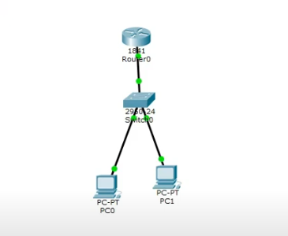

# Tutorial Konfigurasi Jaringan

Panduan ini memberikan langkah-langkah rinci untuk mengonfigurasi jaringan pada perangkat jaringan seperti router dan switch. Ini mencakup berbagai topologi, konfigurasi dasar, dan praktik terbaik.

## Prasyarat

Sebelum memulai tutorial ini, pastikan Anda memiliki:

- Akses ke perangkat jaringan (router, switch, dll.) atau simulator jaringan seperti GNS3.
- Pengetahuan dasar tentang konsep jaringan seperti IP addressing, subnetting, dan VLANs.
- Akses administratif ke perangkat yang akan dikonfigurasi.

## 1. Topologi Jaringan



Deskripsi: Topologi jaringan yang akan dikonfigurasi mencakup satu router dan satu switch yang terhubung ke beberapa perangkat klien.

## 2. Konfigurasi Router

### Konfigurasi IP Dasar

1. Masuk ke perangkat router.
2. Konfigurasi IP pada antarmuka router:

   ```bash
   conf t
   interface Gig0/0
   ip address 192.168.1.1 255.255.255.0
   no shutdown
   exit
   ```
   
3. Konfigurasi rute default:
   
   ```bash
   ip route 192.168.2.0 255.255.255.0 192.168.1.2
   ```
### Verifikasi Konfigurasi
- Periksa IP Interface:

   ```bash
   show ip interface brief
   ```

- Periksa Rute:

   ```bash
   Periksa Rute:
   ```

## 3. Konfigurasi Switch
### Konfigurasi VLAN
1. Masuk ke perangkat switch.
2. Buat VLAN dan tetapkan nama:

   ```bash
   conf t
   vlan 10
   name Sales
   exit
   ```

3. Konfigurasi port switch untuk VLAN:

   ```bas
   interface FastEthernet0/1
   switchport mode access
   switchport access vlan 10
   ```

### Verifikasi Konfigurasi
- Periksa VLAN:

   ```bas
   show vlan brief
   ```

- Periksa Port:

   ```bas
   show interfaces switchport
   ```

## 4. Contoh Konfigurasi Lengkap
Berikut adalah contoh file konfigurasi lengkap untuk router dan switch:
### Router Configuration

   ```bas
   conf t
   interface Gig0/0
   ip address 192.168.1.1 255.255.255.0
   no shutdown
   exit
   ip route 192.168.2.0 255.255.255.0 192.168.1.2
   ```

### Switch Configuration

   ```bas
   conf t
   vlan 10
   name Sales
   exit
   interface FastEthernet0/1
   switchport mode access
   switchport access vlan 10
   ```

## 5. Troubleshooting
Jika Anda menghadapi masalah, periksa hal berikut:

- Pastikan Kabel Terhubung dengan Benar: Periksa koneksi fisik antara perangkat.
- Periksa IP Address: Pastikan tidak ada konflik IP di jaringan.
- Periksa Konfigurasi VLAN: Pastikan port switch terkonfigurasi dengan benar untuk VLAN.

## 6. Dokumentasi Tambahan
Untuk informasi lebih lanjut tentang konfigurasi jaringan, kunjungi:

- Dokumentasi Cisco
- Dokumentasi MikroTik
- Dokumentasi GNS3


